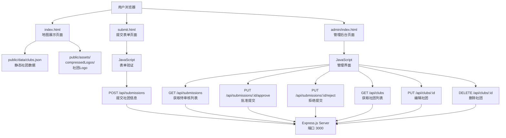
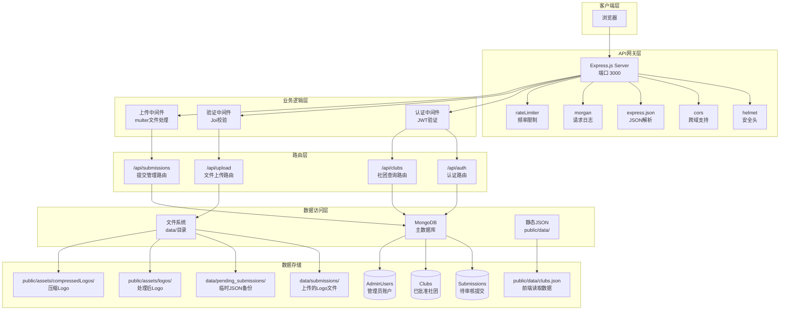

# GameDevMap API 参考文档

**适用版本：** v1.0.0  
**最后更新：** 2025-11-12

---

## 概述

本文档提供 GameDevMap 系统的完整 API 参考。包含网站架构、服务端架构以及所有公开 API 端点的签名和参数说明。

GameDevMap 是一个全国高校游戏开发社团地图系统，提供社团信息的提交、审核、展示和管理功能。

---

## 目录

- [GameDevMap API 参考文档](#gamedevmap-api-参考文档)
  - [概述](#概述)
  - [目录](#目录)
  - [系统架构](#系统架构)
    - [网站架构图](#网站架构图)
    - [服务端架构图](#服务端架构图)
  - [认证 API](#认证-api)
    - [`POST /api/auth/login`](#post-apiauthlogin)
  - [文件上传 API](#文件上传-api)
    - [`POST /api/upload/logo`](#post-apiuploadlogo)
  - [提交管理 API](#提交管理-api)
    - [`POST /api/submissions`](#post-apisubmissions)
    - [`GET /api/submissions`](#get-apisubmissions)
    - [`GET /api/submissions/:id`](#get-apisubmissionsid)
    - [`PUT /api/submissions/:id/approve`](#put-apisubmissionsidapprove)
    - [`PUT /api/submissions/:id/reject`](#put-apisubmissionsidreject)
  - [社团管理 API](#社团管理-api)
    - [`GET /api/clubs`](#get-apiclubs)
    - [`GET /api/clubs/:id`](#get-apiclubsid)
    - [`PUT /api/clubs/:id`](#put-apiclubsid)
    - [`DELETE /api/clubs/:id`](#delete-apiclubsid)
  - [数据同步 API](#数据同步-api)
    - [`GET /api/sync/compare`](#get-apisynccompare)
    - [`POST /api/sync/merge`](#post-apisyncmerge)
    - [`POST /api/sync/replace`](#post-apisiyncreplce)
  - [数据模型](#数据模型)
    - [`Submission` (提交)](#submission-提交)
    - [`Club` (社团)](#club-社团)
    - [`AdminUser` (管理员)](#adminuser-管理员)
  - [错误处理](#错误处理)
  - [延伸阅读](#延伸阅读)
  - [联系方式](#联系方式)

---

## 系统架构

### 网站架构图



### 服务端架构图



---

## 认证 API

### `POST /api/auth/login`

**说明：**  
管理员用户登录，验证用户名和密码，返回JWT访问令牌。

**参数：**

| 参数名 | 类型 | 必填/可选 | 说明 | 默认值 |
|--------|------|----------|------|--------|
| `username` | `string` | 必填 | 管理员用户名 | - |
| `password` | `string` | 必填 | 管理员密码 | - |

**返回值：**
- **类型：** `Object`
- **成功情况：** 返回包含JWT令牌的用户信息
- **失败情况：** 返回错误信息

**使用示例：**

```bash
curl -X POST http://localhost:3000/api/auth/login \
  -H "Content-Type: application/json" \
  -d '{"username":"admin","password":"your_password"}'
```

---

## 文件上传 API

### `POST /api/upload/logo`

**说明：**  
上传社团Logo图片文件，进行格式验证和存储。

**参数：**

| 参数名 | 类型 | 必填/可选 | 说明 | 默认值 |
|--------|------|----------|------|--------|
| `logo` | `File` | 必填 | Logo图片文件（PNG/JPG/GIF/SVG，最大20MB） | - |

**返回值：**
- **类型：** `Object`
- **成功情况：** 返回文件访问路径
- **失败情况：** 返回错误信息

**使用示例：**

```bash
curl -X POST http://localhost:3000/api/upload/logo \
  -F "logo=@logo.png"
```

---

## 提交管理 API

### `POST /api/submissions`

**说明：**  
提交新的社团信息，创建待审核的提交记录。

**参数：**

| 参数名 | 类型 | 必填/可选 | 说明 | 默认值 |
|--------|------|----------|------|--------|
| `submissionType` | `string` | 可选 | 提交类型：'new'或'edit' | 'new' |
| `name` | `string` | 必填 | 社团名称 | - |
| `school` | `string` | 必填 | 所属学校 | - |
| `province` | `string` | 必填 | 所在省份 | - |
| `city` | `string` | 可选 | 所在城市 | - |
| `coordinates` | `Object` | 必填 | 坐标对象 | - |
| `coordinates.latitude` | `number` | 必填 | 纬度 | - |
| `coordinates.longitude` | `number` | 必填 | 经度 | - |
| `short_description` | `string` | 可选 | 社团简介（短） | - |
| `long_description` | `string` | 可选 | 社团简介（长） | - |
| `tags` | `Array<string>` | 可选 | 标签数组 | [] |
| `external_links` | `Array<Object>` | 可选 | 外部链接数组 | [] |
| `logo` | `string` | 可选 | Logo文件路径 | - |
| `submitterEmail` | `string` | 必填 | 提交者邮箱 | - |
| `editingClubId` | `string` | 可选 | 编辑模式下的社团ID | - |

**返回值：**
- **类型：** `Object`
- **成功情况：** 返回提交ID和状态信息
- **失败情况：** 返回验证错误信息

---

### `GET /api/submissions`

**说明：**  
获取提交列表，支持分页、筛选和排序（需要管理员权限）。

**参数：**

| 参数名 | 类型 | 必填/可选 | 说明 | 默认值 |
|--------|------|----------|------|--------|
| `page` | `number` | 可选 | 页码（从1开始） | 1 |
| `limit` | `number` | 可选 | 每页数量（1-50） | 10 |
| `status` | `string` | 可选 | 状态筛选：'pending'/'approved'/'rejected'/'all' | 'pending' |
| `sort` | `string` | 可选 | 排序：'newest'/'oldest' | 'newest' |

**返回值：**
- **类型：** `Object`
- **成功情况：** 返回分页的提交列表
- **失败情况：** 返回错误信息

---

### `GET /api/submissions/:id`

**说明：**  
获取单个提交的详细信息（需要管理员权限）。

**参数：**

| 参数名 | 类型 | 必填/可选 | 说明 | 默认值 |
|--------|------|----------|------|--------|
| `id` | `string` | 必填 | 提交记录ID | - |

**返回值：**
- **类型：** `Object`
- **成功情况：** 返回提交详细信息
- **失败情况：** 返回错误信息

---

### `PUT /api/submissions/:id/approve`

**说明：**  
批准提交，将其转换为正式社团记录（需要管理员权限）。

**参数：**

| 参数名 | 类型 | 必填/可选 | 说明 | 默认值 |
|--------|------|----------|------|--------|
| `id` | `string` | 必填 | 提交记录ID | - |

**返回值：**
- **类型：** `Object`
- **成功情况：** 返回提交ID和新创建的社团ID
- **失败情况：** 返回错误信息

---

### `PUT /api/submissions/:id/reject`

**说明：**  
拒绝提交，标记为已拒绝状态（需要管理员权限）。

**参数：**

| 参数名 | 类型 | 必填/可选 | 说明 | 默认值 |
|--------|------|----------|------|--------|
| `id` | `string` | 必填 | 提交记录ID | - |
| `rejectionReason` | `string` | 必填 | 拒绝原因 | - |

**返回值：**
- **类型：** `Object`
- **成功情况：** 返回操作成功信息
- **失败情况：** 返回错误信息

---

## 社团管理 API

### `GET /api/clubs`

**说明：**  
获取所有已批准社团的列表，支持搜索筛选。

**参数：**

| 参数名 | 类型 | 必填/可选 | 说明 | 默认值 |
|--------|------|----------|------|--------|
| `search` | `string` | 可选 | 搜索关键词（名称、学校、省份等） | - |

**返回值：**
- **类型：** `Array`
- **成功情况：** 返回社团列表数组
- **失败情况：** 返回错误信息

---

### `GET /api/clubs/:id`

**说明：**  
获取单个社团的详细信息。

**参数：**

| 参数名 | 类型 | 必填/可选 | 说明 | 默认值 |
|--------|------|----------|------|--------|
| `id` | `string` | 必填 | 社团ID | - |

**返回值：**
- **类型：** `Object`
- **成功情况：** 返回社团详细信息
- **失败情况：** 返回错误信息

---

### `PUT /api/clubs/:id`

**说明：**  
编辑社团信息（需要管理员权限）。

**参数：**

| 参数名 | 类型 | 必填/可选 | 说明 | 默认值 |
|--------|------|----------|------|--------|
| `id` | `string` | 必填 | 社团ID | - |
| `name` | `string` | 可选 | 社团名称 | - |
| `school` | `string` | 可选 | 所属学校 | - |
| `province` | `string` | 可选 | 所在省份 | - |
| `city` | `string` | 可选 | 所在城市 | - |
| `description` | `string` | 可选 | 详细介绍 | - |
| `shortDescription` | `string` | 可选 | 简介 | - |
| `tags` | `Array<string>` | 可选 | 标签数组 | - |
| `external_links` | `Array<Object>` | 可选 | 外部链接数组 | - |
| `coordinates` | `Array<number>` | 可选 | 坐标数组 [经度,纬度] | - |

**返回值：**
- **类型：** `Object`
- **成功情况：** 返回更新后的社团信息
- **失败情况：** 返回错误信息

---

### `DELETE /api/clubs/:id`

**说明：**  
删除社团记录及其相关Logo文件（需要管理员权限）。

**参数：**

| 参数名 | 类型 | 必填/可选 | 说明 | 默认值 |
|--------|------|----------|------|--------|
| `id` | `string` | 必填 | 社团ID | - |

**返回值：**
- **类型：** `Object`
- **成功情况：** 返回删除成功信息
- **失败情况：** 返回错误信息

---

## 数据同步 API

**说明：** 管理员专用接口，用于同步 MongoDB 数据库和 clubs.json 文件之间的数据。所有接口需要有效的管理员身份验证。

### `GET /api/sync/compare`

**说明：**  
对比 MongoDB 数据库和 clubs.json 文件中的数据，显示差异分析。

**认证：** 需要有效的管理员 Token

**请求头：**
```
Authorization: Bearer <admin_token>
```

**返回值：**

**成功响应（HTTP 200）：**
```json
{
  "success": true,
  "data": {
    "stats": {
      "database": {
        "total": 100,
        "unique": 100
      },
      "json": {
        "total": 98,
        "unique": 98
      },
      "comparison": {
        "identical": 95,
        "different": 2,
        "dbOnly": 3,
        "jsonOnly": 0,
        "conflicts": 0
      }
    },
    "details": {
      "identical": [...],      // 完全相同的社团
      "different": [...],      // 存在差异的社团记录
      "dbOnly": [...],         // 仅在数据库中的社团
      "jsonOnly": [...],       // 仅在 JSON 中的社团
      "conflicts": [...]       // 名称相同但 ID 不同的冲突
    }
  }
}
```

**错误响应：**
- `401 Unauthorized` - 未授权或 Token 过期
- `404 Not Found` - clubs.json 文件不存在
- `500 Internal Server Error` - 服务器错误

---

### `POST /api/sync/merge`

**说明：**  
执行双向智能合并，同步 MongoDB 和 JSON 数据：
- 将 JSON 中的修改合并到 MongoDB
- 将 MongoDB 的新数据添加到 JSON
- 保留双方独有的记录

**认证：** 需要有效的管理员 Token

**请求头：**
```
Authorization: Bearer <admin_token>
```

**返回值：**

**成功响应（HTTP 200）：**
```json
{
  "success": true,
  "message": "双向智能合并完成",
  "data": {
    "database": {
      "added": 2,      // JSON 中新增的记录添加到 MongoDB
      "updated": 3     // JSON 中的数据更新 MongoDB 中的记录
    },
    "json": {
      "added": 1,      // MongoDB 中新增的记录添加到 JSON
      "updated": 0,
      "unchanged": 95
    },
    "total": {
      "added": 3,
      "updated": 3,
      "unchanged": 95
    }
  }
}
```

**错误响应：**
- `401 Unauthorized` - 未授权或 Token 过期
- `500 Internal Server Error` - 合并失败

---

### `POST /api/sync/replace`

**说明：**  
执行单向完全替换，用 MongoDB 中的数据完全覆盖 JSON 文件。JSON 中独有的记录将被删除。

**认证：** 需要有效的管理员 Token

**请求头：**
```
Authorization: Bearer <admin_token>
```

**返回值：**

**成功响应（HTTP 200）：**
```json
{
  "success": true,
  "message": "完全替换完成（MongoDB -> JSON）",
  "data": {
    "mode": "replace",
    "total": 100,
    "added": 100,
    "updated": 0,
    "removed": 0,
    "unchanged": 0
  }
}
```

**错误响应：**
- `401 Unauthorized` - 未授权或 Token 过期
- `500 Internal Server Error` - 替换失败

---

## 数据模型

### `Submission` (提交)

**说明：**  
表示用户提交的社团信息记录，等待管理员审核。

**字段：**

| 字段名 | 类型 | 必填/可选 | 说明 |
|--------|------|----------|------|
| `submissionType` | `string` | 必填 | 提交类型：'new'或'edit' |
| `editingClubId` | `string` | 可选 | 编辑模式下的原社团ID |
| `status` | `string` | 必填 | 状态：'pending'/'approved'/'rejected' |
| `data` | `Object` | 必填 | 社团数据对象（字段结构与Club模型相同） |
| `submitterEmail` | `string` | 必填 | 提交者邮箱 |
| `submittedAt` | `Date` | 自动 | 提交时间 |
| `reviewedAt` | `Date` | 可选 | 审核时间 |
| `reviewedBy` | `string` | 可选 | 审核管理员 |
| `rejectionReason` | `string` | 可选 | 拒绝原因 |

---

### `Club` (社团)

**说明：**  
表示已批准的社团记录，用于前端地图展示。

**字段：**

| 字段名 | 类型 | 必填/可选 | 说明 |
|--------|------|----------|------|
| `name` | `string` | 必填 | 社团名称 |
| `school` | `string` | 必填 | 所属学校 |
| `province` | `string` | 必填 | 所在省份 |
| `city` | `string` | 可选 | 所在城市 |
| `coordinates` | `Array<number>` | 必填 | 坐标 [经度,纬度] |
| `description` | `string` | 可选 | 详细介绍 |
| `shortDescription` | `string` | 可选 | 简介 |
| `tags` | `Array<string>` | 可选 | 标签数组 |
| `logo` | `string` | 可选 | Logo文件名 |
| `external_links` | `Array<Object>` | 可选 | 外部链接数组，每项包含 `type` 和 `url` |
| `createdAt` | `Date` | 自动 | 创建时间 |
| `updatedAt` | `Date` | 自动 | 更新时间 |

---

### `AdminUser` (管理员)

**说明：**  
系统管理员账户信息。

**字段：**

| 字段名 | 类型 | 必填/可选 | 说明 |
|--------|------|----------|------|
| `username` | `string` | 必填 | 用户名 |
| `password` | `string` | 必填 | 密码哈希 |
| `role` | `string` | 必填 | 角色：'admin' |
| `createdAt` | `Date` | 自动 | 创建时间 |

---

## 错误处理

API 错误响应统一格式：

```json
{
  "success": false,
  "error": "ERROR_CODE",
  "message": "错误描述信息"
}
```

**常见错误码：**

| 错误码 | HTTP状态码 | 说明 |
|--------|-----------|------|
| `INVALID_ID` | 400 | ID格式不正确 |
| `NOT_FOUND` | 404 | 资源不存在 |
| `INVALID_STATUS` | 409 | 状态不允许操作 |
| `MISSING_REASON` | 400 | 缺少必要参数 |
| `VALIDATION_ERROR` | 400 | 数据验证失败 |
| `SERVER_ERROR` | 500 | 服务器内部错误 |
| `UNAUTHORIZED` | 401 | 未授权访问 |

---

## 延伸阅读

- [数据同步机制](./DATA_SYNC.md) - MongoDB与JSON的双向同步
- [前端开发指南](./GUIDE.md) - 前端开发和使用说明

---

## 联系方式

如有问题，请联系开发团队或查看项目仓库。
